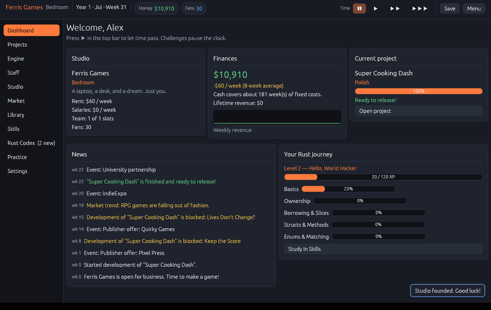
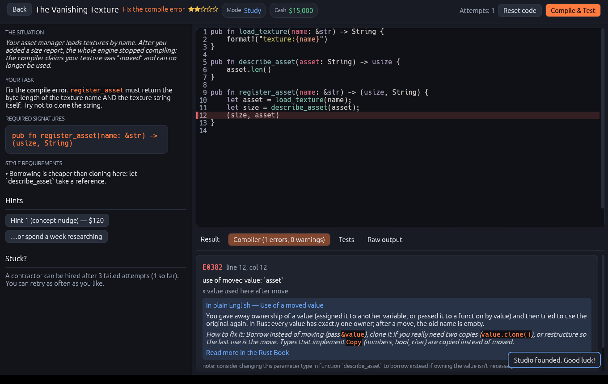
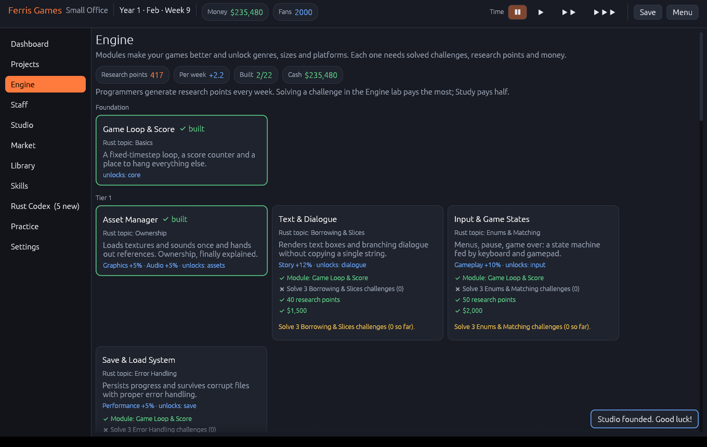
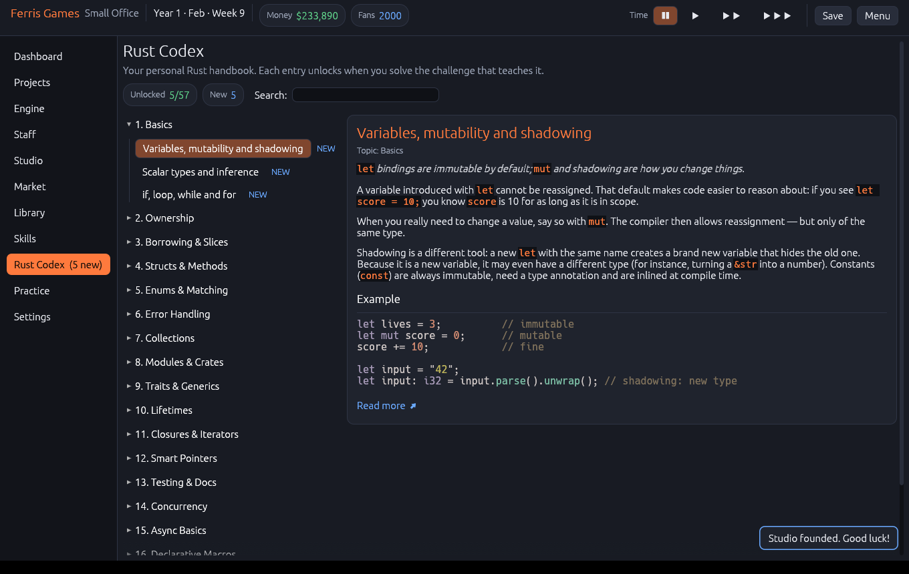

# Rust Studio Tycoon

A game-development tycoon, written entirely in Rust, that **teaches Rust**.

You start alone in a bedroom, build your own engine, ship games and grow a studio into an AAA
headquarters. But development keeps getting blocked by real code problems — and you solve them by
writing real Rust in the in-game editor, which is compiled and tested by **your own `cargo`**.
The tycoon loop is the motivation; the curriculum is the point.

| | |
|---|---|
|  |  |
|  |  |

## Quick start

You need a Rust toolchain, both to build the game and — at runtime — to check your solutions.
Install it from <https://rustup.rs> (stable, Rust **1.95 or newer**).

```sh
cargo run --release -p rust-studio-tycoon
```

On Linux you may need the usual windowing libraries first
(Debian/Ubuntu: `sudo apt install libxkbcommon-dev libwayland-dev libx11-dev libgl1-mesa-dev`).

If `cargo` cannot be found when the game starts, the game does not crash: it shows install
instructions for `rustup` and lets you keep playing the tycoon side, retrying detection at any time.

> **Safety note — your code runs on your machine.** Challenge solutions are real programs. They are
> compiled and executed locally in a throw-away cargo project inside the game's data directory, with
> a timeout, an output limit, resource limits (Unix) and process-group cleanup — but this is a
> convenience sandbox, **not a security boundary**. Do not paste code you do not understand, and
> do not run the game with privileges you would not give to a Rust program you wrote yourself.

## How to play

* **Dashboard** — your studio at a glance. Press ▶ in the top bar to let time pass (one tick = one
  week). Time stops whenever a decision or a challenge is waiting for you.
* **Skills** — the 19-topic curriculum (Basics → Ownership → Borrowing → Structs → Enums → Errors →
  Collections → Modules → Traits → Lifetimes → Iterators → Smart pointers → Testing → Concurrency →
  Async → Macros → Operators & conversions → Unsafe & FFI → Performance). Study challenges for XP;
  mastering a topic unlocks the next.
* **Engine** — build modules (core loop, renderer, physics, networking, …). Each needs research
  points, money and *solved challenges* in its topic, and unlocks genres, project sizes and platforms.
* **Projects** — choose genre × theme × platform × audience × size and set the focus sliders. Work is
  periodically **blocked until you solve a challenge**; solved challenges add progress and quality.
* **Staff / Studio** — hire and train people (seniors give free hints), move into bigger offices,
  take loans, license your engine. Bankruptcy is real.
* **Market / Library** — trends, rival studios, platform lifecycles, reviews from five fictional
  outlets, sales curves, patches, DLC and sequels.
* **Rust Codex** — a searchable handbook (57 entries) that unlocks as you solve challenges.
* **Practice** — replay solved challenges for free, with free hints, with no effect on your studio.

### The code editor

Tab indents, Enter keeps the indentation, **Ctrl+Enter** (or the button) runs *Compile & Test*. Your
code is written into an isolated cargo project, compiled with the real compiler, and checked by
hidden unit tests. Compile errors are shown with code, line and message — plus a plain-language
explanation for the common ones (E0382 moved value, E0499/E0502 borrow conflicts, E0106 missing
lifetime, E0308 mismatched types, …). You can retry as often as you like; tiered hints cost money or
a week of research; after a few failures you can hire a contractor — but you always get to see the
solution and the explanation. Progress is never blocked permanently.

### Eight kinds of challenge

Fix a compile error · complete a function · write from scratch · find a logic bug · predict the output
(multiple choice) · refactor to idiomatic Rust (tests *and* static checks such as "no `unwrap`, no
`for`") · performance (timing limits on large inputs) · code review (which snippet is buggy or
unsound).

## Content is data

All game content lives in [`content/`](content) as [RON](https://github.com/ron-rs/ron) files and is
embedded into the binary at build time. You can add challenges, Codex entries, events, genres,
platforms or engine modules **without touching any Rust code**: drop a `.ron` file into
`<data dir>/content/` (or point `RST_CONTENT_DIR` at a folder) and restart. See
[docs/CONTENT.md](docs/CONTENT.md) for the schema and the authoring workflow.

Every challenge is verified against the real compiler — the reference solution must pass its hidden
tests and the starter code must not:

```sh
cargo run -p studio-core --bin validate-challenges -- --workers 4            # everything (~1 min)
cargo run -p studio-core --bin validate-challenges -- --filter lifetimes_    # one topic
```

CI runs the same validator on every push.

## Where things are stored

Saves (`autosave` + 4 manual slots, versioned JSON with a migration chain), settings and the sandbox
live in the per-user data directory chosen by the [`directories`](https://docs.rs/directories) crate
(for example `~/.local/share/ruststudiotycoon` on Linux). Set `RST_DATA_DIR` to use another folder.

## Project layout

```
crates/studio-core   library: data schema + loader, challenge runner/validator, simulation, saves
crates/studio-app    the eframe/egui application (one module per screen)
content/             challenges, codex, game data (RON)
docs/                DESIGN.md (architecture + decisions), CONTENT.md (authoring guide)
```

The simulation (`studio-core::sim`) has no UI dependencies and is deterministic for a given seed. An
**autoplay bot** plays whole careers at three skill levels and three difficulties, and the balance
tests assert that the economy stays fair (a competent player can build a studio without going broke,
hard mode bites, skill pays off, money never explodes).

## Develop

```sh
cargo fmt --all
cargo clippy --workspace --all-targets -- -D warnings
cargo test --workspace
cargo run -p studio-core --bin validate-challenges -- --workers 4
```

`unwrap`/`expect` are linted in production code. Headless UI tests render every screen (and every
challenge) without a window. For tuning, `cargo test -p studio-core --test balance -- --ignored
--nocapture` prints career summaries.

Developer shortcut for screenshots: `cargo run -p rust-studio-tycoon -- --dev-screen "game:Engine:rich"`
(other specs: `new`, `load`, `sim:<Screen>:<weeks>[:release]`, `event:<id>`,
`challenge:<id>[:solution|:starter]`).
